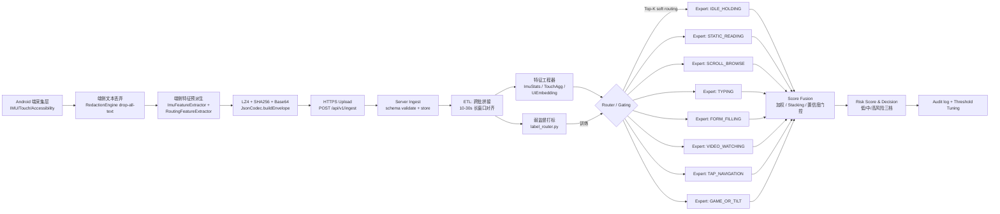

# MoE 多场景专家路由与持续认证方案设计

> 本文档基于《当前 App 采集数据全景分析_claude.md》与《采集数据与 MoE 上下文认证方案契合度分析_claude.md》的结论，给出一份**可工程落地**的 MoE 路由 + 持续身份认证方案。覆盖整体架构、路由器设计、8 个专家模型逐一设计、融合策略、训练数据采集、评测指标、阶段化路线图与风险开放问题。文中使用 mermaid 图、表格与伪代码，输入维度、网络结构与训练目标可直接被工程师采纳。

## 目录

1. 整体架构
2. 路由（Gating / Router）模型设计
3. 8 个专家模型的逐一设计
4. 路由策略与融合
5. 训练数据采集方案
6. 评测指标
7. 工程落地路线图（阶段 A → D）
8. 风险与开放问题

---

## 1. 整体架构

### 1.1 端到端数据流（mermaid）



### 1.2 关键组件

| 组件 | 位置 | 责任 |
|---|---|---|
| 采集层 | Android | 数据采集 + 端侧文本丢弃（drop-all-text，已有） |
| 端侧特征派生 | Android（新增 `ImuFeatureExtractor`、`RoutingFeatureExtractor`） | 1 Hz 窗口聚合，减带宽 |
| ETL | Server | 跨批拼接、时间对齐、缺失补齐 |
| Router | Server（GPU 推理或纯 CPU） | 8-way 概率输出 |
| Experts | Server | 8 个独立的认证模型，每个输出 score ∈ [0,1] |
| Fusion | Server | 把 router 概率 × 专家 score 合并 |
| Decision | Server | 阈值化输出 LOW/MED/HIGH risk |

### 1.3 在线推理延迟与吞吐预算

| 环节 | 目标 |
|---|---|
| 端 → 服务器单批 (5 s) | ≤ 1 s 网络 + ETL（含跨批拼接） |
| Router 单次推理 | ≤ 10 ms（轻量 MLP / GBDT）；≤ 50 ms（Transformer-based gating） |
| Top-2 专家并行推理 | ≤ 100 ms p95 |
| 单用户端到端延迟（采集结束 → 决策） | ≤ 3 s（含 5 s 采集窗口边界等待） |
| 单机吞吐目标 | 500 设备 × 12 batch/min ≈ 100 QPS |

---

## 2. 路由（Gating / Router）模型设计

### 2.1 输入特征工程

路由器是低维快速分类器，输入约 80-120 维（参考下表）。所有特征都基于 **5 s 或 10 s 滑窗** 聚合后的标量 / 向量：

| 类别 | 字段 | 维度 |
|---|---|---|
| **应用上下文** | `app_package_name` 经 hashing trick → 32 维 sparse | 32 |
|  | `foreground_activity_class_name` 经 hashing → 16 维 | 16 |
|  | `coarse_orientation` 独热 (port/landscape/...) | 4 |
| **UI 启发式** | `editable_count` / `scrollable_count` / `clickable_count` 的窗口均值 + 方差 | 6 |
|  | `media/list/form/game_like_score` 的窗口最大值 | 4 |
|  | `input_method_visible` 窗口内累计秒数 + 切换次数 | 2 |
|  | `node_class_histogram` 投影到 16 个固定 bucket（TextView/Button/RecyclerView/EditText/SurfaceView/...） | 16 |
| **节点直方图** | `viewIdResourceName` 经 MinHash → 8 维签名 | 8 |
| **事件密度** | 每秒 `TYPE_VIEW_SCROLLED` 数、`TYPE_WINDOW_*` 切换数、`TYPE_VIEW_CLICKED` 数 | 3 |
| **触控密度** | 全局触控 interaction rate、interaction interval P50/P95 | 3 |
| **IMU 统计** | accel/gyro/mag 三轴的 `mean、std、energy(1-4Hz)、energy(4-12Hz)` | 24 |
| **跨批指标** | 距上一批的 ΔT、`gated_resume` 标志 | 2 |
| 合计 | | ~120 |

### 2.2 候选模型对比

| 候选 | 优点 | 缺点 | 推荐场景 |
|---|---|---|---|
| **轻量 MLP（3 层、隐藏 256）** | 推理快 (~5 ms)、训练简单、可端侧部署 | 离散类别建模弱；需 OHE+embedding | 阶段 B 起点（最推荐） |
| **GBDT（LightGBM）** | 鲁棒、对噪声特征不敏感、可解释 | 难以学时序；soft routing 概率校准较差 | 阶段 A baseline（启发式 +GBDT） |
| **Transformer-based gating（小 BERT，4 层、维度 256）** | 学到事件序列；TYPING/SCROLL 节奏建模强 | 推理慢；冷启动数据成本高 | 阶段 D 升级 |
| **Hard Gating（top-1）** | 简单、推理快 | 难以处理混合场景（如 video + scroll） | 路由 v1 |
| **Soft Gating（top-k softmax）** | 容错；输入混合上下文 | 多专家计算开销 | 路由 v2+（推荐） |

**建议路线**：阶段 B 用 MLP + soft top-2 routing；阶段 D 升级为 Transformer-based gating。

### 2.3 标签来源（如何为 8 个场景打标签）

混合策略：

| 策略 | 适用范围 | 实现 |
|---|---|---|
| **直接抄录** | `collection_source=BUILTIN_TASK` | 用 `task_category` 直接得到 ground truth |
| **启发式打标** | `THIRD_PARTY_APP` 主流场景 | 服务端 `label_router.py` 用如下规则： |
|  | C3 TYPING | `input_method_visible` 累计 ≥ 2 s 且 editable ≥ 1 |
|  | C2 SCROLL_BROWSE | `TYPE_VIEW_SCROLLED` 频次 ≥ 1 /s 且 IMU 中频能量适中 |
|  | C6 VIDEO_WATCHING | media_like_score=0.8 且事件密度极低 |
|  | C0 IDLE_HOLDING | IMU 三轴 std < threshold 且无任何触控 / scroll |
|  | C5 TAP_NAVIGATION | tap rate ≥ 1/s 且无 IME / scroll |
|  | C7 GAME_OR_TILT | 角速度大或 Game UI（Canvas/SurfaceView 非媒体） |
| **主动标注** | 边界用例 / 模糊样本 | 人工标 1k-5k 样本作金标集，**专门用于 router 验证集** |
| **自监督聚类** | 长尾未知场景 | 用 IMU + UI feature 做 contrastive learning / SimCLR，得到 unknown bucket 用于 fallback |

### 2.4 训练数据构造、样本均衡、冷启动

| 项目 | 设定 |
|---|---|
| 训练集规模目标 | 100 万 + window，覆盖 50+ 用户 |
| 类别平衡 | C0/C1/C6 易过采样 → **下采样**至 max(per-class)/3；C5/C7 难得 → 内置任务**主动收集** |
| 验证集 | 5%-10% 全人工金标，跨设备拆分 |
| 测试集 | 独立 5 设备 × 8 场景，模拟未见用户 |
| 冷启动 | **router 用 BUILTIN_TASK 数据预训练 + heuristic 标签 fine-tune**；专家用同设备多 session 做自监督预训练 |
| 数据增强 | IMU 随机扰动、UI bag-of-words 删丢、时间窗滑动 |

### 2.5 路由器伪代码

```python
# 服务端：router.py
def predict_router(window_features: WindowFeatures) -> dict[ExpertName, float]:
    x = featurize(window_features)         # ~120 维 numpy array
    logits = router_model.forward(x)        # shape [8]
    probs = softmax(logits)
    return {name: float(p) for name, p in zip(EXPERTS, probs)}

def top_k_route(probs, k=2, threshold=0.15):
    # 取 top-k，且至少满足 prob>threshold；不足 k 时用 IDLE fallback
    ranked = sorted(probs.items(), key=lambda kv: -kv[1])
    picks = [name for name, p in ranked if p >= threshold][:k]
    if not picks:
        picks = ['IDLE_HOLDING']  # fallback
    return picks, {name: probs[name] for name in picks}
```

---

## 3. 8 个专家模型的逐一设计

> 每个专家的目标都是：给定一个 5-30 s 窗口的多模态特征，输出"该窗口与目标用户行为一致的概率" score ∈ [0,1]。下表的"训练目标"全部默认为 **孪生网络 / 对比学习 / one-class 异常检测三选一**。

### 3.1 IDLE_HOLDING（C0 / 持机静止）

| 项目 | 设计 |
|---|---|
| 主导信号 | Accel/Gyro/Mag 三轴低频统计；持机姿态 |
| 输入特征 | 10 s × 100 Hz × 9 维（3 accel + 3 gyro + 3 mag），可下采样到 1000 步 |
| 网络结构 | **1D CNN（4 层，kernel=7→5→3，channel 32→64→128）+ Global Avg Pool + MLP(128→64→32)** |
| 训练目标 | Triplet（anchor=该用户 IDLE、positive=同用户 IDLE、negative=其他用户 IDLE）；margin=0.2 |
| 输出 | embedding 32 维 → 与该 device 中心 embedding 的 cosine 相似度 → sigmoid → score |
| 未知拒识 | embedding 与全局中心的距离 > 3σ → 标记 `unknown`，score=NaN，融合时按 fallback 处理 |
| 备注 | 该专家训练数据最丰富（C0 任务 + 大量空闲），最早可上线 |

### 3.2 STATIC_READING（C1 / 静态阅读）

| 项目 | 设计 |
|---|---|
| 主导信号 | Accel 低带 + Gyro 慢俯仰漂移 + 偶发 scroll |
| 输入特征 | 30 s 长窗：IMU 序列 + scroll event 间隔序列 + 节点直方图 |
| 网络结构 | **双塔**：IMU 塔（1D CNN 同 IDLE）+ UI 塔（MLP 处理 node hist + scroll stats）→ concat → MLP(96→32) |
| 训练目标 | Contrastive (NT-Xent), `tau=0.1` |
| 输出 | embedding cosine → score |
| 未知拒识 | mahalanobis 距离 |

### 3.3 SCROLL_BROWSE（C2 / 信息流滚动）

| 项目 | 设计 |
|---|---|
| 主导信号 | scroll event 节奏 + IMU 抖动伴随模式 |
| 输入特征 | 15 s 窗：scroll event ΔT 序列（变长→pad 到 60）+ IMU 同步序列 |
| 网络结构 | **LSTM(128) + Attention** 处理 scroll ΔT；另一条 1D CNN 处理 IMU；融合后 MLP(64) |
| 训练目标 | Triplet + 时序对比 |
| 输出 | score |
| 备注 | 受限于无坐标，**滑动距离 / 速度全部缺失**，唯一抓手是"节奏特征"——这是为何阶段 D 的弱触控替代特征 (E2) 必须先到位 |

### 3.4 TYPING（C3 / 文本输入）

| 项目 | 设计 |
|---|---|
| 主导信号 | IME 状态切换 + editable focus 持续时间 + 击键期间手部小幅 yaw |
| 输入特征 | 10 s 窗：`input_method_visible` 二进制时序（1 Hz）+ `editable focus` 切换 ΔT 序列 + Gyro yaw 高频谱 |
| 网络结构 | **小型 Transformer（2 层，head=4，dim=128）** 处理 IME / focus 时序；与 Gyro 1D CNN 联合 |
| 训练目标 | InfoNCE + 用户分类辅助任务 |
| 输出 | score |
| **关键风险** | APP-09 禁止逐键时序——**这个专家性能上限受限**，必须接受 EER 高于传统 keystroke dynamics。建议接受 EER ≈ 15-20% baseline，重在和路由 + 其他专家融合后整体表现 |

### 3.5 FORM_FILLING（C4 / 表单填写）

| 项目 | 设计 |
|---|---|
| 主导信号 | 控件焦点转移序列（focus / select / click 混合） + IME 间歇 + IMU 短时静止-动作交替 |
| 输入特征 | 15 s 窗：event_type 序列（独热）+ node_class_histogram 时序变化（每秒一帧）+ IMU stats |
| 网络结构 | **GRU(128) + UI MLP + IMU CNN → MLP(64)** |
| 训练目标 | Triplet |
| 输出 | score |
| 备注 | C4 内置任务专门提供训练样本（"模拟手机设置"） |

### 3.6 VIDEO_WATCHING（C6 / 视频观看）

| 项目 | 设计 |
|---|---|
| 主导信号 | 横屏切换、姿态长时漂移、播控间隔（pause/seek/speed） |
| 输入特征 | 30 s 窗：orientation 序列、IMU 低带、Activity 切换间隔、media_like_score |
| 网络结构 | **1D CNN(IMU) + MLP(orientation + ui)** 双塔 → concat |
| 训练目标 | Contrastive |
| 备注 | 强依赖 **M1（动态 orientation）** 与 **M2（高阶 IMU）** |

### 3.7 TAP_NAVIGATION（C5 / 横屏触控挑战 / 蓝球）

| 项目 | 设计 |
|---|---|
| 主导信号 | tap interval 分布 + tap 簇形态 + tap 期间 IMU 短峰 |
| 输入特征 | 10 s 窗：tap event 时间戳序列（变长→pad 60）+ tap-cluster ΔT 直方图 + IMU 微峰统计 |
| 网络结构 | **LSTM(128)** + **CNN(IMU)** 并联 → MLP(64) |
| 训练目标 | Triplet |
| **关键约束** | **无 x/y**，所以 tap-to-tap displacement 完全缺失。建议加上 IMU 在 tap 瞬间的"小手颤"模式作为补偿 |

### 3.8 GAME_OR_TILT（C7 / 手腕转动 / 倾斜操控）

| 项目 | 设计 |
|---|---|
| 主导信号 | 角速度峰、姿态轨迹、旋转节奏 |
| 输入特征 | 10 s 窗：Gyro/RotationVector/LinearAccel/Gravity 序列（采集后） |
| 网络结构 | **1D CNN(深 6 层) + BiLSTM(64)** |
| 训练目标 | Triplet + 时序自监督预训练（mask & reconstruct） |
| 备注 | 强依赖 **M2（高阶 IMU 传感器）** |

### 3.9 通用约定

| 通用项 | 取值 |
|---|---|
| Embedding 维度 | 32 |
| 训练 batch size | 256 |
| Optimizer | AdamW，lr=1e-3，cosine decay |
| Loss | 各专家见上 |
| 输出归一化 | sigmoid(cosine_sim × τ)，τ=10 |
| 拒识阈值 | `unknown` 当 mahalanobis>3σ 或 embedding norm<阈值 |
| 模型大小 | 每个专家 < 2 MB（部署友好） |

---

## 4. 路由策略与融合

### 4.1 Hard vs Soft Routing 选择

| 策略 | 计算开销 | 容错性 | 推荐 |
|---|---|---|---|
| Hard top-1 | 1× expert | 路由错则错到底 | 阶段 B 试水 |
| Soft top-2 | 2× expert | 路由模糊时混合得分 | **生产推荐** |
| Soft top-k (k≥3) | k× expert | 边际收益递减 | 仅在 router 极不准时用 |

### 4.2 多专家分数融合

设 router 概率 $p_i$（$\sum p_i = 1$）、专家 score $s_i \in [0,1] \cup \{\text{NaN}\}$，则融合公式：

```
final_score = Σ_{i in TopK, s_i≠NaN}  p_i * s_i  /  Σ_{i in TopK, s_i≠NaN}  p_i
```

如果 TopK 中所有专家都返回 NaN（未知拒识），则进入 **fallback path**：
- 用 IDLE_HOLDING 的 score 作 baseline；
- 同时把窗口标记为 `LOW_CONFIDENCE`，触发更长窗口（30 s）重判。

### 4.3 异常 / 未知场景回落

```
if router.max_prob < 0.30:
    fallback_to = "UNKNOWN"
    expert_set = [IDLE_HOLDING]   # 永远兜底
    flag = "router_low_confidence"
elif any(expert.score is NaN for expert in selected):
    flag = "expert_unknown"
else:
    flag = "ok"
```

### 4.4 决策阈值（三档风险）

| Final score | 风险档 | 处置 |
|---|---|---|
| ≥ 0.80 | LOW | 静默放行 |
| 0.50-0.80 | MED | 软提示（如再输入一次 PIN） |
| < 0.50 | HIGH | 强挑战（指纹 / 人脸） |

阈值用验证集做 ROC 调优，分场景独立 calibrate（因为 TYPING 专家精度天然低，需要稍微宽松）。

---

## 5. 训练数据采集方案

### 5.1 持续在线学习

| 数据 | 来源 |
|---|---|
| 阶段 A 训练集 | 内置 C0-C7 任务，每位被试每场景 10 min × 50 用户 |
| 阶段 B 训练集 | THIRD_PARTY_APP 自然使用，弱监督打标 |
| 阶段 C 持续训练 | 每周增量 fine-tune（concept drift） |
| 阶段 D 联邦学习 | 把模型权重而非数据下发 / 上传，端侧训练（**可选**） |

### 5.2 正负样本

| 样本 | 构造 |
|---|---|
| 正样本 | 同 `device_id` 长间隔 session 内（≥ 24 h 间隔）相同场景 |
| 负样本 hard | 不同 `device_id` 但相同 `task_category` / 路由类别（强对比） |
| 负样本 easy | 跨场景跨 device |
| 限制 | 排除明显异常的 batch（IMU 缺口 > 30%、redaction 命中过多） |

**重要风险**：同一 `device_id` 可能由多人使用（家庭场景）。需要在阶段 B 引入"主用户假设"：用聚类把同 device 的多 session 划入 K=2 候选 user，再以最稳定 cluster 作为该 device 的"主用户"。

### 5.3 标签噪声处理

- 启发式打标的样本默认权重 0.5；金标人工 1.0；不一致样本（启发式 vs 模型预测分歧大）进 active learning 队列。
- 跨 batch 拼接时 IMU 中断 > 500 ms 的窗口标记为 `discard_imu_gap`，不参与训练。

---

## 6. 评测指标

### 6.1 路由指标

| 指标 | 定义 | 目标 |
|---|---|---|
| Router Top-1 Acc | 路由 argmax == ground truth | ≥ 0.80 |
| Router Top-2 Acc | top-2 包含 ground truth | ≥ 0.95 |
| Router Confusion | 8×8 矩阵 | 报告 |
| Per-class Recall | 每场景召回 | C5 / C7 ≥ 0.70（最难） |

### 6.2 认证指标（每专家）

| 指标 | 定义 |
|---|---|
| **EER** | False Accept Rate == False Reject Rate 时的错误率 |
| **FAR@FRR=1%** | 限定 FRR=1% 时的 FAR（生产阈值参考） |
| **AUC** | ROC 曲线下面积 |
| **Continuous Auth Latency** | 从行为开始到首次决策稳定的秒数 |

### 6.3 端到端

| 指标 | 目标 |
|---|---|
| 整体 EER（融合后） | < 5% |
| 高风险 alert 误报率 | < 0.5% / 用户 / 天 |
| Risk → 真实异常 / 总异常召回 | > 80% |

### 6.4 对比实验设计

| 对比 | 设置 |
|---|---|
| A: 单一全局模型 | 不分场景，所有数据训一个 1D CNN+LSTM |
| B: MoE 但仅 UI 路由 | 路由仅用 UI 特征 |
| C: MoE 完整方案 | 本文方案 |
| 期望 | C 比 A EER 降 30%+；C 比 B 在 GAME_OR_TILT / TYPING 上提升明显 |

### 6.5 Ablation 子实验

| 去除 | 期望影响 |
|---|---|
| UI 特征 | EER ↑ 在 C2/C3/C4/C6 |
| 高阶 IMU (M2) | EER ↑ 在 C7 / C6 |
| 横竖屏 (M1) | EER ↑ 在 C5/C6/C7 |
| 弱触控替代特征 (E1-E3) | EER ↑ 在 C2/C3/C5 |
| 跨批拼接 (M6) | Continuous Auth Latency ↑ |

---

## 7. 工程落地路线图

### 阶段 A：补齐采集 + 场景标签（预计 4 周）

| 工作项 | 负责 | 难度 |
|---|---|---|
| 接入已实现的动态 `coarse_orientation` 到训练特征 | Android/ETL | 低 |
| 实现 M2（GameRotationVector/LinearAccel/Gravity） | Android | 低 |
| 服务端 schema 扩展支持新传感器枚举 | Server | 低 |
| 实现 M3（端侧 IMU 派生统计） | Android | 中 |
| 实现 M4（路由用窗口聚合特征） | Android | 中 |
| 实现 E10（横竖屏切换事件） | Android | 低 |
| 服务端 ETL：M6 跨批拼接 | Server | 中 |
| 弱监督打标管线 M5 | Server | 中 |
| 解决 M7（加密或文档修订） | 跨端 | 中 |
| **里程碑**：每窗口都有 8 类弱监督标签 + 完整特征向量 | | |

### 阶段 B：路由器 v1（预计 3 周）

| 工作项 | 负责 | 难度 |
|---|---|---|
| Router MLP 实现 + 训练 + 评测 | ML | 中 |
| Top-1 → Top-2 切换 | ML | 低 |
| 路由 ground truth 金标集（5k 样本人工标） | 标注 | 中 |
| **里程碑**：Router Top-1 Acc ≥ 0.80（在金标集上） | | |

### 阶段 C：专家模型逐个上线（预计 6-8 周）

按上线优先级（从信号充足到信号薄弱）：

1. IDLE_HOLDING（最快上线，IMU 充足）
2. VIDEO_WATCHING（M1+M2 到位后）
3. STATIC_READING
4. GAME_OR_TILT（M2 后）
5. FORM_FILLING
6. SCROLL_BROWSE（E2 弱触控替代）
7. TAP_NAVIGATION（E3 弱触控替代）
8. TYPING（E1 弱击键替代，EER 接受较高）

| 里程碑 | 验收 |
|---|---|
| 4 周末 | 前 4 个专家 EER < 8% |
| 8 周末 | 所有 8 专家上线，融合后 EER < 5% |

### 阶段 D：联合训练 / 端到端 MoE（预计 4-6 周）

- 端到端联合 router + experts，loss = α·router_loss + β·Σ expert_loss
- 引入 expert utilization auxiliary loss（避免 router 偏好少数专家）
- 评估是否升级 Router 到 Transformer-based gating
- 引入联邦学习或差分隐私（O2）

---

## 8. 风险与开放问题

### 8.1 模型漂移（concept drift）

- **现象**：用户更换设备 / 应用版本更新 → UI 结构变化 → router 失效
- **缓解**：每周 fine-tune；引入"app 版本"特征；保留 `unknown` fallback

### 8.2 隐私合规

- **当前** `encryption=none` 与 idea 描述不符，必须补 AES 或修订（M7）
- 加密策略候选：AES-GCM-256 / payload 层；密钥由 server 公钥下发 + 设备私钥本地存储
- 联邦学习路线可大幅降低明文数据上行

### 8.3 对抗攻击

| 攻击类型 | 风险 | 缓解 |
|---|---|---|
| 重放攻击（重发旧 batch） | 中 | 服务端按 `(device_id, batch_id)` 去重 + `created_at_wall_millis` 单调校验 |
| Spoof IMU（模拟器） | 高 | IMU + UI + Activity 多模一致性校验；模拟器的 IMU 特征 std 几乎为 0 |
| Spoof UI（截屏后人工编排节点） | 低 | 节点 ID / hashCode 易模拟；但跨批一致性难造 |
| 对抗样本（IMU 微扰） | 中 | 训练时加入 Gaussian noise 增强 |

### 8.4 数据稀疏场景

- C5/C7 的 ground truth 严重不足 → 阶段 A 必须主动收集；可引入 simulator 合成
- 长尾应用包名（小众 App） → router 用 hashing trick 处理 OOV

### 8.5 启发式打标污染

- 启发式打标错误会被模型学习并放大
- 缓解：金标集独立验证；启发式标签权重 0.5；active learning 召回不一致样本

### 8.6 多用户同设备

- 当前 `device_id = HMAC(salt, ANDROID_ID)`，与人无关，多用户共享设备会污染正负样本
- 缓解：服务端用 IMU 微抖特征做无监督聚类，划分 device 内 K=2 主用户
- 长期可考虑端侧"主用户开关"（用户登录态）

### 8.7 路由器与专家共谋失败

- 路由错且专家又 fail open → 用户被误放行
- 缓解：融合层引入 hard floor——只要任一专家 score < 0.20，整体不可 LOW

### 8.8 未实现专家的回退

- 阶段 C 前期只上线 4 个专家，路由器选到未上线专家时怎么办？
- 解决：保留 `expert_implementation_status` 表，未实现的专家在融合时复制最近一次 IDLE_HOLDING 的 score 作回退，并打 `flag=expert_not_ready`

### 8.9 idea 与 APP-09 的根本张力

- TYPING 与 TAP/SCROLL 专家天然受限。即便完成本方案，与"传统 keystroke dynamics + swipe trajectory" 论文的对比 EER 仍会落后
- **诚实结论**：本方案的卖点不在"刷 EER"，而在"在严格隐私边界内仍能做 MoE 多场景持续认证"——这是 idea 真正的差异化贡献

---

## 附录 A：核心数据结构（伪代码）

```python
# server/app/router/types.py
@dataclass
class WindowFeatures:
    device_id: str
    session_id: str
    started_at_ms: int
    ended_at_ms: int
    app_package: str
    activity: str | None
    orientation: str             # M1 后
    ime_visible_secs: float
    ime_switch_count: int
    scroll_rate: float
    tap_rate: float
    tap_interval_p50_ms: float | None
    tap_interval_p95_ms: float | None
    editable_count_avg: float
    scrollable_count_avg: float
    clickable_count_avg: float
    media_like_max: float
    list_like_max: float
    form_like_max: float
    game_like_max: float
    node_hist_buckets: np.ndarray  # 16 维
    view_id_minhash: np.ndarray    # 8 维
    accel_stats: np.ndarray        # 8 维: 3 axes × (mean,std)+energy(1-4Hz)+energy(4-12Hz)
    gyro_stats: np.ndarray         # 8 维
    mag_stats: np.ndarray          # 8 维
    rotation_vector_stats: np.ndarray | None   # M2 后
    label_router: ExpertName | None            # 弱监督打标

@dataclass
class ExpertResult:
    expert: ExpertName
    score: float | None    # None 表示 unknown
    embedding: np.ndarray
    confidence: float
    flag: str              # ok / unknown / expert_not_ready

@dataclass
class FinalDecision:
    device_id: str
    window_id: str
    router_top_k: list[tuple[ExpertName, float]]
    expert_results: list[ExpertResult]
    final_score: float
    risk_level: Literal['LOW', 'MED', 'HIGH']
    flags: list[str]
```

## 附录 B：训练循环伪代码（Triplet）

```python
def train_expert(expert_name, dataset, model, epochs=30):
    optim = AdamW(model.parameters(), lr=1e-3, weight_decay=1e-4)
    sched = CosineAnnealingLR(optim, T_max=epochs)
    for ep in range(epochs):
        for anchor, pos, neg in dataset.triplet_iter(batch_size=256):
            ea, ep_, en = model(anchor), model(pos), model(neg)
            loss = triplet_loss(ea, ep_, en, margin=0.2)
            optim.zero_grad(); loss.backward(); optim.step()
        sched.step()
        eer = evaluate_eer(model, dataset.val)
        print(f"[{expert_name}] ep={ep} loss={loss:.4f} EER={eer:.4f}")
```

## 附录 C：在线推理伪代码

```python
def infer_window(window_features: WindowFeatures) -> FinalDecision:
    router_probs = predict_router(window_features)
    top_k_names, top_k_probs = top_k_route(router_probs, k=2, threshold=0.15)

    expert_results = []
    for name in top_k_names:
        expert = EXPERTS[name]
        if expert.status != 'ready':
            expert_results.append(ExpertResult(name, None, None, 0, 'expert_not_ready'))
            continue
        emb = expert.encode(window_features)
        score, conf = expert.score_against_user_centroid(window_features.device_id, emb)
        flag = 'unknown' if score is None else 'ok'
        expert_results.append(ExpertResult(name, score, emb, conf, flag))

    final_score = fuse(top_k_probs, expert_results)
    risk = thresholdize(final_score, scene=top_k_names[0])
    return FinalDecision(
        device_id=window_features.device_id,
        window_id=f"{window_features.session_id}@{window_features.started_at_ms}",
        router_top_k=list(zip(top_k_names, top_k_probs.values())),
        expert_results=expert_results,
        final_score=final_score,
        risk_level=risk,
        flags=[e.flag for e in expert_results]
    )
```

---

**完。** 本方案的最大价值是把"严格隐私边界 (APP-09) + 多场景持续认证"这一对张力工程化地拆解为可上线的阶段方案，并在每个阶段给出了具体的输入维度、网络结构、训练目标与评测指标。建议从阶段 A 的 M1 / M2 / M3 / M5 同时启动，4 周内进入阶段 B 路由器 v1 训练；阶段 C 让前 4 个专家先跑通完整链路，再用 6-8 周补足其余 4 个有信号约束的专家。
